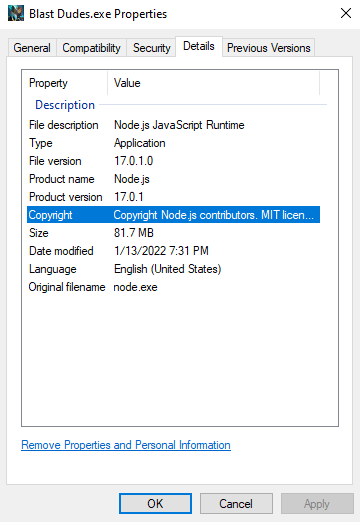
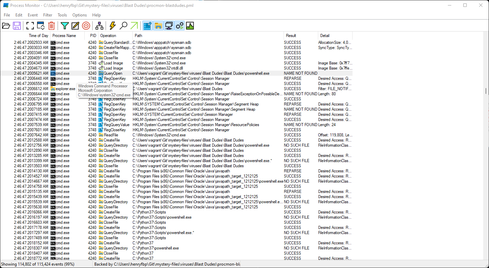
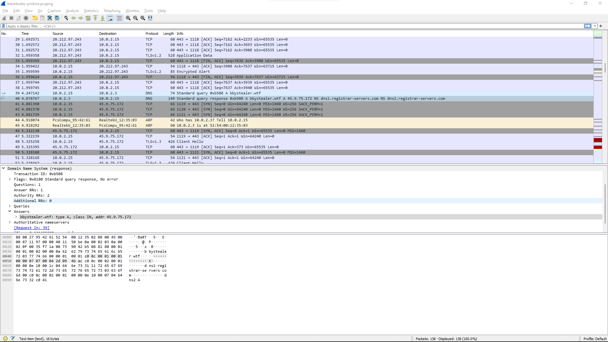

## app.info
DefaultCompany
Velocimom



### \Managed\Assembly-CSharp.dll

```cs
// Decompiled with JetBrains decompiler
// Type: VelocimomAnimationHandler
// Assembly: Assembly-CSharp, Version=0.0.0.0, Culture=neutral, PublicKeyToken=null
// MVID: 8EE2D356-0F4A-4E99-A2FE-FDF4139217C6
// Assembly location: C:\Users\vagrant\Git\mystery-files\viruses\Blast Dudes\Blast Dudes\Blast-Dudes-DATA\Managed\Assembly-CSharp.dll

using Pathfinding;
using UnityEngine;

public class VelocimomAnimationHandler : MonoBehaviour
```

Stolen from velocimom?

## UABE

Useless.

## UAE

https://archive.org/details/UnityAssetsExplorer

Useless.

## npm asar

Not an asar...

It seems the Unity files are unrelated to the exe.

## cutter

The entire Node.JS binary is in here.

From a STRING recovered from address `0x1453c74aa`,

```json
"msbuild_path": "D:\\VisualStudio\\MSBuild\\Current\\Bin\\MSBuild.exe",
    "cache": "C:\\Users\\Usuario\\AppData\\Local\\npm-cache",
    "globalconfig": "C:\\Users\\Usuario\\AppData\\Roaming\\npm\\etc\\npmrc",
    "global_prefix": "C:\\Users\\Usuario\\AppData\\Roaming\\npm",
    "init_module": "C:\\Users\\Usuario\\.npm-init.js",
    "local_prefix": "C:\\Users\\Usuario\\Downloads",
    "metrics_registry": "https://registry.npmjs.org/",
    "node_gyp": "C:\\Users\\Usuario\\AppData\\Roaming\\npm\\node_modules\\npm\\node_modules\\node-gyp\\bin\\node-gyp.js",
    "prefix": "C:\\Users\\Usuario\\AppData\\Roaming\\npm",
    "userconfig": "C:\\Users\\Usuario\\.npmrc",
    "user_agent": "npm/8.3.0 node/v17.3.0 win32 x64 workspaces/false"
  }\n}\n<?xml version="1.0" encoding="utf-8"?>\n<Project DefaultTargets="Build" ToolsVersion="14.0" xmlns="http://schemas.microsoft.com/developer/msbuild/2003">
  <ItemGroup Label="ProjectConfigurations">
    <ProjectConfiguration Include="Debug|x64">
      <Configuration>Debug</Configuration>
      <Platform>x64</Platform>
    </ProjectConfiguration>
    <ProjectConfiguration Include="Release|x64">
      <Configuration>Release</Configuration>
      <Platform>x64</Platform>
    </ProjectConfiguration>
  </ItemGroup>
  <PropertyGroup Label="Globals">
    <ProjectGuid>{ECE413C6-4239-9A04-946C-A28C7F60D12E}</ProjectGuid>
    <Keyword>Win32Proj</Keyword>
    <RootNamespace>node-dpapi</RootNamespace>
    <IgnoreWarnCompileDuplicatedFilename>true</IgnoreWarnCompileDuplicatedFilename>
    <PreferredToolArchitecture>x64</PreferredToolArchitecture>
    <WindowsTargetPlatformVersion>10.0.19041.0</WindowsTargetPlatformVersion>
  </PropertyGroup>
  <Import Project="$(VCTargetsPath)\Microsoft.Cpp.Default.props"/>
  <PropertyGroup Label="Configuration">
    <ConfigurationType>DynamicLibrary</ConfigurationType>
  </PropertyGroup>
  <PropertyGroup Label="Locals">
```

Some guy called `Usuario` built this, perhaps. Means "user" in spanish, so could just be a spanish anon.

See [strings.txt](data/strings.txt) for more strings.

Also `pwnBetterDiscord`... Might have to extract some JS.

## binary ninja

looks cool, slow ;p try it out.

## process hacker and procmon

[See this file.](captures/procmon-blastdudes-pristine.pml)

WoW!!! VERY SUSSY!!!!!



It always deletes its payloads!

Maybe use file recovery software in `C:\Users\vagrant\AppData\Local\Temp\`?

## recuva

[The PS1 payload](data/recuva)

```cs
using System;
using System.Runtime.InteropServices;

namespace Console
{
    public class Window
    {
    
    [DllImport("Kernel32.dll")]
    public static extern IntPtr GetConsoleWindow();
    [DllImport("user32.dll")]
    public static extern bool ShowWindow(IntPtr hWnd, Int32 nCmdShow);
    

    }

}
```

Odd. Not sure how this is useful to them. Perhaps this is only used to show a console window.

## give it a discord account to steal

TODO

### procmon

todo

### wireshark

todo

## wireshark w/o discord acct

Some SUSSY ass domains!!!

It asks for `bbystealer [dot] wtf` and then sends a bunch of TLS traffic to it!



See [this file](captures/wireshark-blastdudes-pristine.pcap).