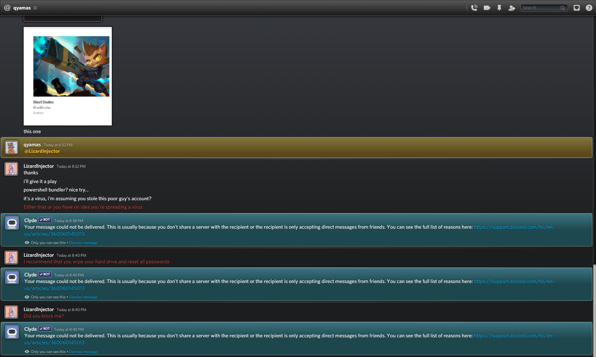
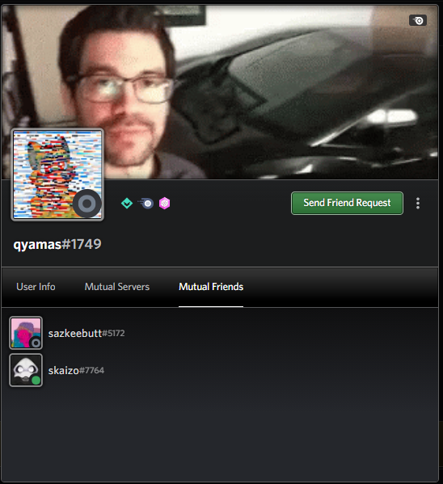
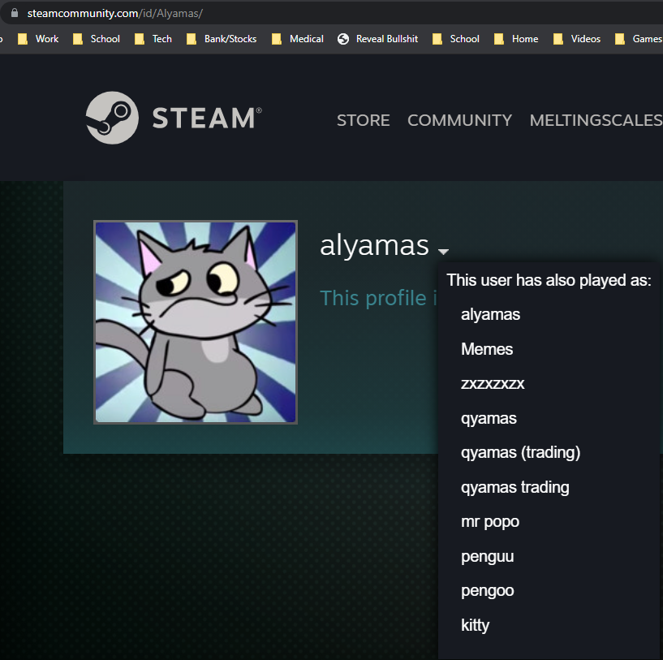
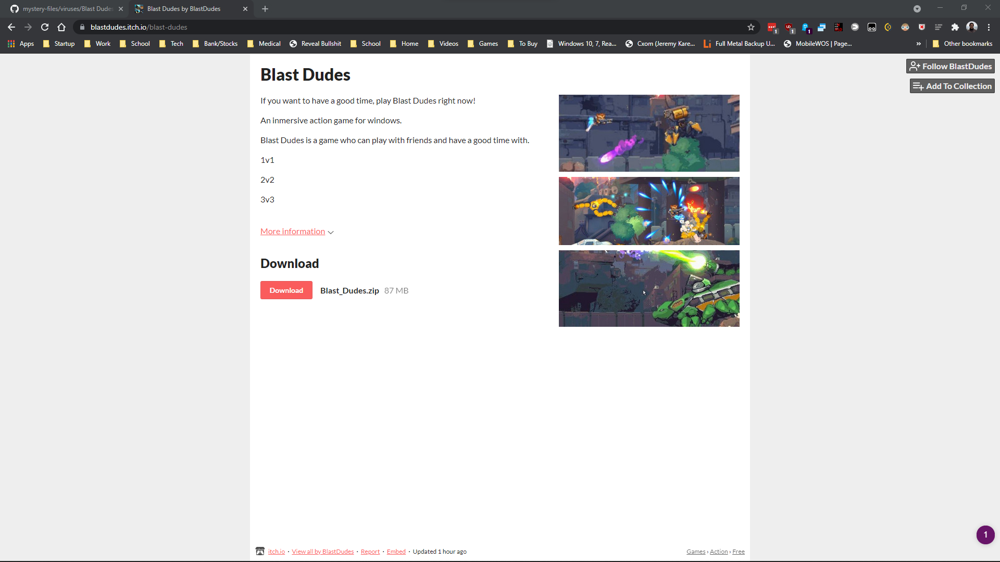

sent to me by this guy, qyamas

qyamas is possibly hacked, it's possible the person originally owning the account was not behind this.

-   qyamas#1749  
-   https://youtu.be/7YvAYIJSSZY  
-   https://steamcommunity.com/profiles/76561198117736027
    -   blocked by him on steam
-   https://blastdudes.itch.io/blast-dudes  

It seems to be a discord stealer/powershell dropper, DO NOT unzip outside a VM... And be careful even then.

[Malware analysis in NOTES.md](NOTES.md)

## related resources

Apparently, this is a copy of an existing Discord stealer called "PirateStealer".

-   https://github.com/henryfbp/piratestealer-1
-   https://github.com/henryfbp/piratestealer

And below are some more info about the software.

-   https://www.reddit.com/r/netsec/comments/rc1thm/malicious_npm_packages_are_after_your_discord/
-   https://gist.github.com/DiscordSaver/1477943130cf53c8a8c760d0df1b896e
-   https://gist.github.com/DiscordSaver
-   https://twitter.com/DiscordSaver
-   https://twitter.com/stanleytry
-   If you find more token grabbers upload them here. https://sketchy.tel/#/
    -   https://sketchy.tel/#/hash/5329f51b3a97f72b7b212466d02919892136a642d181e6cb36fb00ca8b216ba4
        -   hxxps://bbystealer DOT wtf/ikHrd6k2PqZU/tokens
        -   hxxps://bbystealer DOT wtf/ikHrd6k2PqZU/str

### notes 2

To sum up what piratestealer and bbystealer do: Execute game -> Execute payload -> Payload looks for cookies/tokens/saved passwords in browsers -> Downloads injection payload -> Kills Betterdiscord -> Injects payload into electron file -> Starts Discord -> Injection payload is watches for webhook calls inside of discord to capture information -> Sends information to C2 server.

## screenshots

